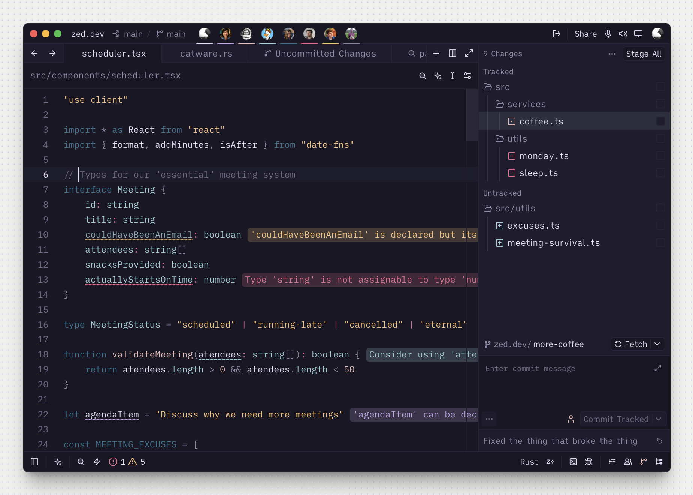
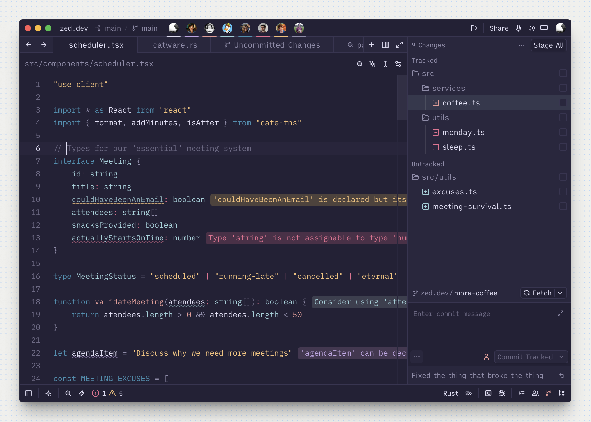
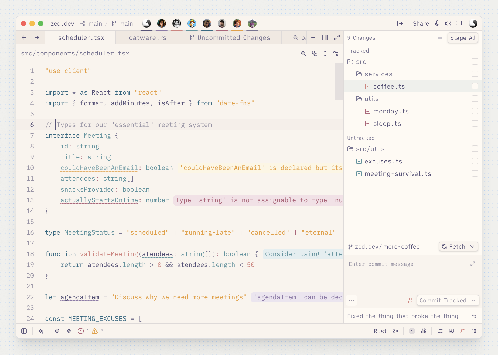

    
    <h2 align="center">Rosé Pine (No Italics) for Zed</h2>

All natural pine, faux fur and a bit of soho vibes for the classy minimalist — a custom italic-free syntax design on the Rosé Pine palette.

    

## About

This is **not** simply the official theme with italics switched off. It keeps the canonical Rosé Pine palette unchanged, but reworks how those colors map to syntax — reassigning over 20 token scopes, defining several the official theme doesn't, and removing italics from code (retained only on markdown emphasis and AI ghost text). The **Rosé Pine** name credits the palette; the syntax design is its own.

Because it's a different design rather than a toggle, it ships as a standalone theme alongside — not a replacement for — the official Rosé Pine.

## Usage

1. Install the **Rosé Pine (No Italics)** extension from Zed extensions
2. Select your desired variant from the theme selection menu

## Variants

- Rosé Pine
- Rosé Pine Moon
- Rosé Pine Dawn

## Gallery

### Rosé Pine

### Rosé Pine Moon

### Rosé Pine Dawn

## Credits

Built on the canonical [Rosé Pine palette](https://rosepinetheme.com) and inspired by the official [Rosé Pine for Zed](https://github.com/rose-pine/zed) theme. The syntax-color mapping and italic removal are specific to this variant.

## License

[MIT](LICENSE)
